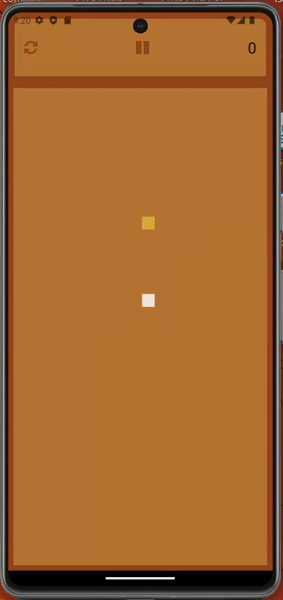

# Snake Game - React Native

Welcome to the Snake game repository, developed using React Native! This game is compatible with both iOS and Android platforms. This is my first React Native project.

Follow the instructions below to set up and test the game.

----

 

## Prerequisites

### Development Environment

**Node.js & npm**: Required to manage the project's dependencies and run the development server -> [Download Node.js](https://nodejs.org/).

**React Native CLI**: Used to initiate new React Native projects and execute commands.

``npm install -g react-native-cli``

 

### Platform-Specific
**Android:**
**Android Studio & Android SDK**: Required for emulating and debugging React Native applications for Android -> [Download Android Studio](https://developer.android.com/studio).

**iOS** (only on macOS):
**Xcode**: Needed for emulating and debugging React Native applications for iOS -> [Download Xcode from the Mac App Store](https://apps.apple.com/us/app/xcode/id497799835).

 

### Testing environnement
To check if your environnement is good to go :

``npx react-native doctor``

----

## Installation

 

1. **Clone the repository:**
   
``git clone https://github.com/jmbertin/snake-react-native.git``
``cd snake-react-native``

3. **Install the dependencies:**
   
``npm install``

4. **Running**

**On Android:**
1. Start an Android emulator through Android Studio or connect an Android device with USB debugging mode enabled.

2. In your terminal, navigate to the project folder and run:
   
``npm start`` and press **a** button.

**On iOS:**
1. To run the project on an iOS simulator:
   
``react-native run-ios``

 

----

 

## Contributing
If you wish to contribute to the project, please create a pull request and detail the changes you're proposing.

 

----

 

## License
This project is under the MIT license.
